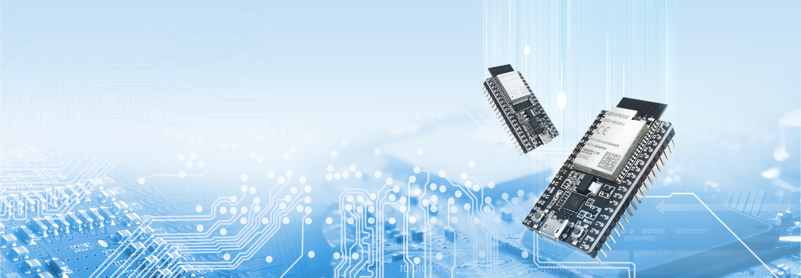

# ESP32 TCP/IP Echo server



|Used board|ESP Module|Used platform|
|---|---|---|
|ESP32_DevKitc_V4|ESP32-WROOM-32D|Mongoose OS|

### Requirements

- Listen port : 11122
- Max. active connections : 5
- Message terminated with CR/LF (ASCII encoding, line based)
- Response with the requested message
- API 
  - Count active connections
  - Messages count for every active connection

---
# Setup development environment

### Install MOS tool
<small>* Used version 2.19.1
```
sudo add-apt-repository ppa:mongoose-os/mos
sudo apt-get update
sudo apt-get install mos
mos update 2.19.1
mos
```

### Build and flash the project

Change WiFi SSID and password in mos.yml

```
mos build --local --verbose
mos flash
```

### Test the connection

```
netcat <ip address> 11122
```
---
# Homepage

Homepage load active connections on every 500 ms and show them in simple table

---
# Rest API

- All responses are with Content-Type : application/json
- Added CORS header for cross domain access

## 1. Get count of active connections

#### Request:

**GET** /api/conn-count

#### Response:

```
{
  "count": 0
}
```


## 2. Get all active connections

#### Request:

**GET** /api/conn-slots

#### Response:

```
[
  {
    "in_use":true,
    "in_cnt":0,
    "out_cnt":0,
    "client":"0.0.0.0:1234"
 },
 {
    "in_use":true,
    "in_cnt":0,
    "out_cnt":0,
    "client":"0.0.0.0:1234"
 },
]
```